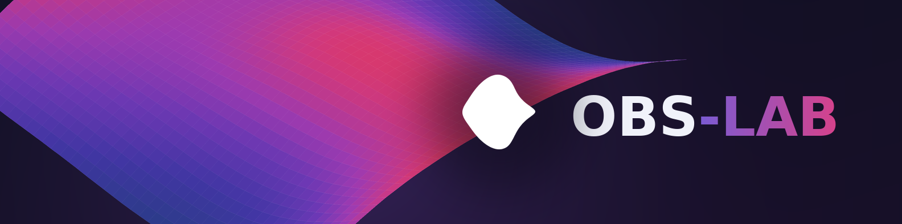
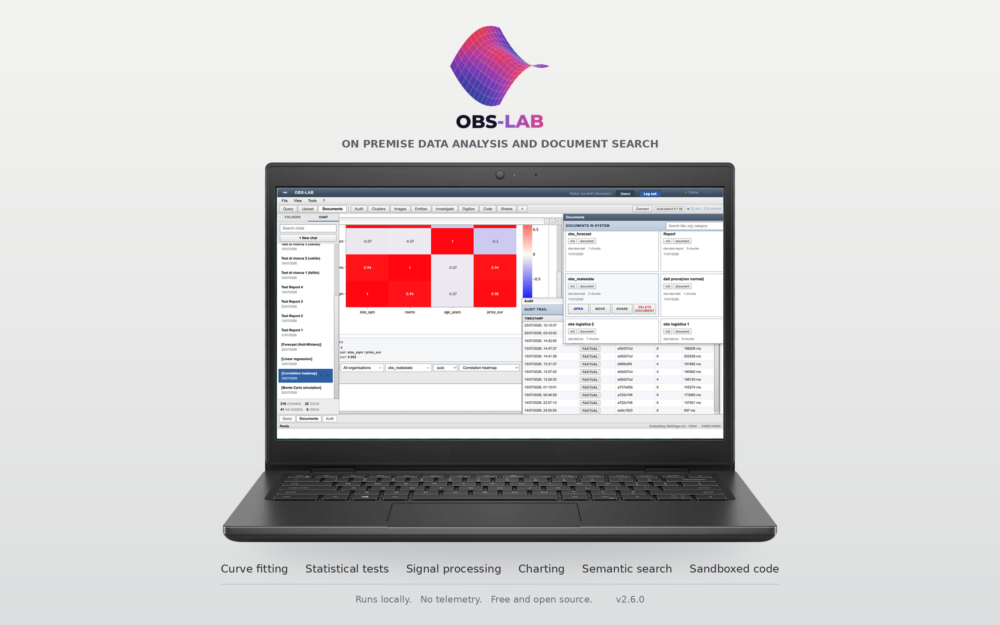
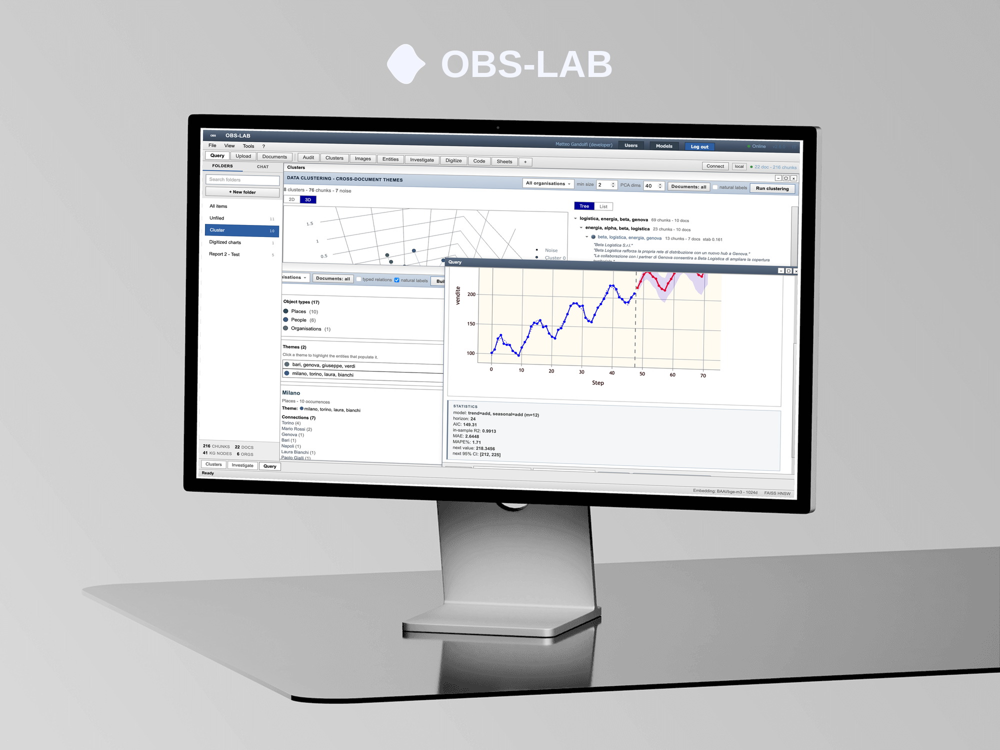
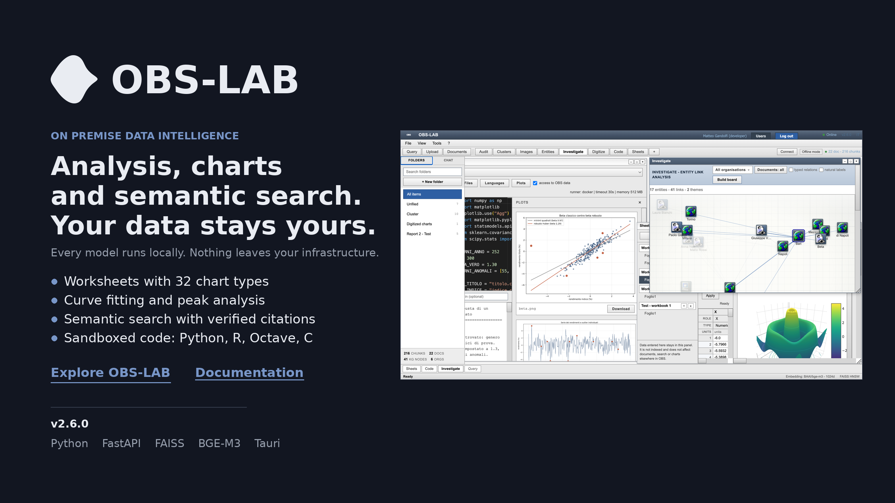

<div align="center">


<br/>

[](#)
[](https://www.python.org/downloads/)
[](https://fastapi.tiangolo.com/)
[](https://tauri.app/)
[](#privacy)
[](#quick-start)

</div>

<br/>

# On-premise data and document intelligence

**OBS-LAB** turns a private pile of documents, spreadsheets, images, and raw numbers into a *structured, searchable, analysable* archive, and it does it entirely on your own machine. You ask questions in plain language and get answers that cite the exact documents they came from. You run statistics, forecasts, and simulations on the numbers inside your files. You execute code against the archive in sandboxed containers. You explore the people, organisations, and places your documents talk about.

Nothing touches the network unless you deliberately choose a cloud language model. The index, the embeddings, the statistics engine, the entity graph, and the image analysis all run on the hardware in front of you. That is the whole point: **your data never leaves your infrastructure.**

<div align="center">

</div>

<br/>

<div align="center">

[What you'll find](#what-youll-find) &nbsp;&middot;&nbsp;
[Capabilities](#capabilities) &nbsp;&middot;&nbsp;
[Language model modes](#language-model-modes) &nbsp;&middot;&nbsp;
[Quick start](#quick-start) &nbsp;&middot;&nbsp;
[Module map](#module-map) &nbsp;&middot;&nbsp;
[Documentation](#documentation) &nbsp;&middot;&nbsp;
[Privacy](#privacy)

</div>

---

## What you'll find

<a href="#what-youll-find">#</a>

Most document-intelligence tools ask you to ship your archive to a cloud service and trust that it stays private. OBS-LAB inverts that arrangement. The only outbound traffic that can ever leave the machine is a cloud language model, and only when you explicitly turn it on. Search, statistics, clustering, and image analysis never depend on that choice and never reach outside. This makes OBS-LAB a fit for legal, medical, financial, research, and public-sector archives where the data is not allowed to leave the building.

At its foundation OBS-LAB is a web interface served by a local **FastAPI** backend and opened in your browser. A **Tauri** desktop shell also lives in the repository, but the browser is the supported way to run it. Ingestion handles chunking and embeddings. Search runs on a **FAISS** index refined by cross-encoder reranking. Statistics, clustering, entity extraction, and image analysis all execute locally, in process, on your files. The worksheet panel keeps its own data in a separate database that never touches the document archive.

The design principle running through every module is substitutability: heavy components sit behind narrow interfaces, so the vector store or the graph backend can be swapped without rewriting the pipeline above them. The retrieval quality does not change when the storage underneath does.

<div align="center">

</div>

```
        Browser  ->  loads the local web UI
                  |
                  v
        Local backend (FastAPI)
        |
        |-- Ingestion    chunking + embeddings
        |-- Search       FAISS index + cross-encoder reranking
        |-- Analysis     robust statistics, forecasting, Monte Carlo
        |-- Entities     resolution + typed relation graph
        |-- Images       visual + text search, colour, chart digitizing
        |-- Code         sandboxed containers, permission-scoped tokens
        |-- Worksheets   separate database, isolated from the archive
        |-- Agents       user-defined, bounded, permission-inherited
        |-- Voice        local transcription and speech, no remote fallback
        |-- Local files  read in place, never uploaded, never indexed
                  |
                  v
        Language model (your choice):  cloud API  |  local  |  none
```

---

## Capabilities

<a href="#capabilities">#</a>

### Semantic document search

Ask questions in natural language, in any language, and get answers grounded in your own material. Retrieval combines a dense vector index with cross-encoder reranking so that the candidates the index proposes are re-scored for real relevance before they reach the answer. Every generated report is checked citation by citation against its sources, so the system points you back to the document instead of inventing one.


### Data processing and analysis

Work with the numbers inside your files. Charts, statistical analysis, forecasting, and Monte Carlo simulation all run locally. A built-in robust-statistics stack recovers reliable estimates even when a handful of anomalous observations would distort ordinary methods, so a few bad rows do not quietly poison the result.

### Worksheets

Enter data directly into spreadsheet-style grids and analyse it without uploading a document at all. Column roles (X, Y, error bars, labels, groups) drive the charts, so an error column set once is reused by every plot that accepts it. The panel offers curve fitting on nine nonlinear models, regression, peak analysis, signal processing, and statistical tests, with thirty-two chart types ranging from interactive 3D surfaces to Piper, ternary, and wind-rose diagrams. It is fully isolated: its data lives in a separate database and never touches the document archive, the search index, or the entity graph.

<div align="center">

</div>

### Code and formulas

Write and run scripts against your archive in Python, R, Octave, JavaScript, Java, C, and C++. Each language runs in a disposable, sandboxed container with no access to the host and no access to the database beyond an ephemeral, permission-scoped token. HTML and CSS preview live in the browser.

### Clustering and entity analysis

Group related material into themes across the whole archive, then explore an entity graph that resolves people, organisations, and places, links entities that appear together, and can enrich those links with typed, source-verified relations. The graph is a map of what your documents actually say about who, not a guess.

### Image analysis

Search images by visual content and by the text inside them, sample and compare colours, and pull numeric data straight out of charts.

<div align="center">

</div>

### Agents

Register your own agents and let them work on the archive: a script in the sandbox, a step loop where the model calls only the tools you declared, or a call to an agent you built elsewhere. Every run has a step budget and a time ceiling, keeps a full trace, and inherits the permissions of the person who owns it. Agents pointing outside your network need an explicit allow list.

### Voice

Dictate a question and hear the answer read back, or leave it hands free and hold a conversation. Transcription and speech both run on your machine, and the voice follows the language of the answer. The browser speech API is deliberately not used, because on some browsers it sends the audio to a remote service.

### Files already on the machine

Point OBS-LAB at a folder and it browses, searches, and analyses what is there, reading in place. Nothing is uploaded, nothing is indexed, nothing is written. Removing the folder from the allowed list revokes the access with nothing left behind, and system folders, credentials, and key material are refused whatever you register.

### Multi-user and access control

Each person signs in and sees only their own material, with role-based ownership and sharing built in from the start.

---

## Language model modes

<a href="#language-model-modes">#</a>

For the language model you pick one of three modes, and only the first one can ever reach the network.

| Mode | What it does | Network |
|------|--------------|---------|
| **Cloud API** | Uses an external provider for generation | Outbound, only when you enable it |
| **Local** | Runs a language model on your own hardware | Fully offline |
| **None** | Search and analysis only, no generation | Fully offline |

Search, statistics, clustering, and image analysis behave identically in all three.

---

## Quick start

<a href="#quick-start">#</a>

You need Python 3.11 and the dependencies listed in `requirements.txt`. The embedding model is about 2.2 GB and is downloaded once on first launch rather than shipped inside the app.

**macOS and Linux**

```bash
python3.11 -m venv venv
source venv/bin/activate
pip install -r requirements.txt
./start.sh
```

**Windows**

```bat
python -m venv venv
venv\Scripts\activate
pip install -r requirements.txt
start.bat
```

**Server deployment**

```bash
./start_prod.sh      # macOS/Linux
start_prod.bat       # Windows
```

On a fresh installation there are no accounts. The backend redirects to `/setup`, where you create the first administrator. After the first login, if the embedding model is missing, the app opens a one-click download page and starts once the model is ready. Configuration is read from a `.env` file; every variable is documented in the command guide.

---

## Module map

<a href="#module-map">#</a>

| Area | Files |
|------|-------|
| Backend entry | `main.py` |
| Auth and accounts | `auth.py`, `auth_routes.py`, `obs_admin.py`, `ownership.py` |
| Retrieval backends | `backends.py`, `model_setup.py`, `download_model.py` |
| Code execution | `code_clients.py`, `code_store.py`, `code_files.py`, `code_routes.py`, `runners.py` |
| Worksheets | `sheets_compute.py`, `sheets_plots.py`, `sheets_routes.py`, `sheets_store.py` |
| Images | `color_analysis.py`, `digitizer_core.py` |
| Sharing | `sharing.py`, `sharing_routes.py` |
| Agents | `agents.py`, `agents_store.py`, `agents_routes.py`, `llm_bridge.py` |
| Voice | `voice.py`, `voice_routes.py` |
| Local files | `fs_access.py`, `fs_routes.py` |
| Frontend | `index.html`, `login.html`, `setup.html`, `models.html`, `i18n.js`, `obs_*_frontend.js`, `obs_panels.css` |
| Desktop shell | `lib.rs`, `main.rs`, `Cargo.toml`, `tauri.conf.json`, `build.rs` |
| Sandbox images | `python.Dockerfile`, `r.Dockerfile`, `octave.Dockerfile` |

---

## Documentation

<a href="#documentation">#</a>

| Guide | Content |
|-------|---------|
| `COMMAND_GUIDE.md` | Installation, running, administration, troubleshooting |
| `CODE_GUIDE.md` | Setup for the code-execution languages |
| `SERVER_DIRECTION.md` | Long-term architecture and migration direction |

---

**Contact**

- **Email** obslab2026@gmail.com
- **LinkedIn** [OBS-LAB](https://www.linkedin.com/company/obs-lab)
- **Web** [obs-lab.github.io](https://obs-lab.github.io/)

---

## Privacy

<a href="#privacy">#</a>

The design principle is simple and it holds everywhere in the system: your archive never leaves your infrastructure. Models run on your hardware, data is stored locally, and the only outbound traffic possible is a cloud language model that you must explicitly enable. Speech runs locally in both directions, files read from the machine are never uploaded or indexed, and an agent that points outside your network is refused unless an administrator allows that host.

---

<div align="center">
<sub><b>OBS-LAB 2.6.0</b> - built to keep your data where it belongs.</sub>
</div>
